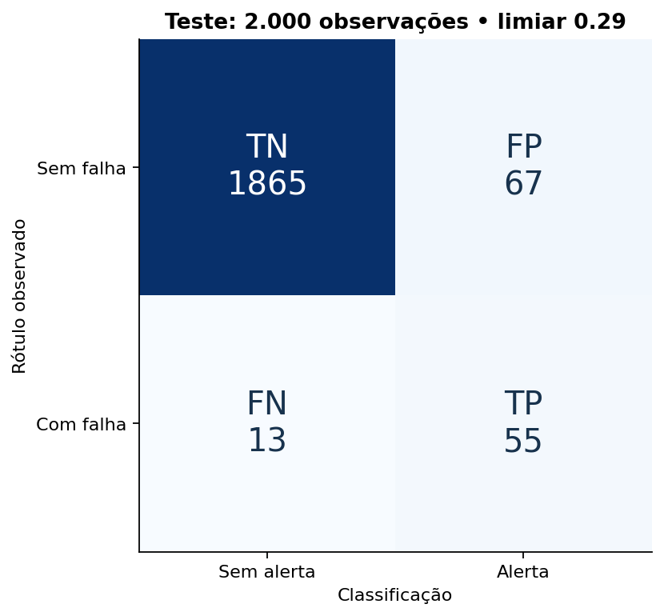

# Classificação de falhas em condições operacionais industriais

Repositório público: [Vict0r-13/falhas-industriais-ai4i](https://github.com/Vict0r-13/falhas-industriais-ai4i).

Projeto de ciência de dados que conecta análise de perdas industriais, estatística, machine learning e comunicação com Power BI. A pergunta é: **quais observações de condições operacionais estão associadas a falhas e qual é o compromisso entre detectar falhas e gerar falsos alarmes?**

**Dados sintéticos.** Este estudo classifica observações do [AI4I 2020, publicado pela UCI](https://doi.org/10.24432/C5HS5C). Não demonstra antecipação temporal de paradas, causalidade ou ganho financeiro/fabril real.

## Resultado verificado

A floresta aleatória foi selecionada pela maior average precision na validação, com limiar **0,29** escolhido antes de consultar o teste. Avaliação em **2.000 observações reservadas, com 68 falhas**:

| Métrica | Floresta selecionada | Baseline sem alertas |
|---|---:|---:|
| Average precision (AP) | 0,6407 | 0,0340 |
| ROC AUC | 0,9650 | 0,5000 |
| Recall | 80,9% | 0,0% |
| Precisão dos alertas | 45,1% | Indefinida: nenhum alerta |
| Falhas detectadas | 55 | 0 |
| Falhas não detectadas | 13 | 68 |
| Falsos alarmes | 67 | 0 |
| Acurácia | 96,0% | 96,6% |

O baseline tem acurácia maior e não detecta nenhuma falha. A floresta produz 122 alertas, dos quais 55 são corretos. A precisão de 45,1% torna a capacidade de inspeção uma parte central da discussão. Na exportação numérica, precisão/F2 sem predições positivas são registrados como zero por convenção do cálculo, sem significar que a precisão é estimável.

O IC de Wilson de 95% do recall vai de **70,0% a 88,5%**, sob hipótese de independência e modelo fixado. Dados sintéticos relacionados podem violar essa hipótese. Consulte os [resultados completos](reports/resultados.md) para matriz, intervalos, seleção e sensibilidade.



## Como executar

Use Python **3.12**. No terminal, entre nesta pasta. Primeira instalação precisa de internet; a análise usa a cópia pública incluída e funciona sem rede depois que as dependências estão instaladas.

**Windows / PowerShell**

```powershell
python -m venv .venv
.\.venv\Scripts\python.exe -m pip install -r requirements-lock.txt
.\.venv\Scripts\python.exe -m src.run
.\.venv\Scripts\python.exe -m unittest discover -s tests -v
.\.venv\Scripts\python.exe -m src.predict examples/condicoes.csv reports/exemplo_predicoes.csv
```

**Linux / macOS**

```bash
python3.12 -m venv .venv
.venv/bin/python -m pip install -r requirements-lock.txt
.venv/bin/python -m src.run
.venv/bin/python -m unittest discover -s tests -v
.venv/bin/python -m src.predict examples/condicoes.csv reports/exemplo_predicoes.csv
```

`requirements.txt` lista dependências diretas; `requirements-lock.txt` fixa também as transitivas do ambiente validado. A verificação local foi feita em Windows/Python 3.12.14. Outros sistemas devem executar os testes. O pipeline regenera relatórios, CSVs, cinco figuras e `models/modelo.joblib`. Os exemplos são ilustrativos e não constituem novas observações reais. Execute a partir da raiz do projeto para que `python -m src...` encontre os módulos.

Se o CSV em `data/raw/ai4i2020.csv` estiver ausente, a aquisição baixa a cópia oficial e exige o SHA-256 registrado. Se o checksum divergir, investigue a mudança em vez de desativar a validação. O modelo serializado é gerado localmente e ignorado pelo Git; carregue apenas o arquivo produzido por este projeto.

## Desenho do experimento

1. Contrato da fonte e partições estratificadas de 6.000/2.000/2.000 observações, seed 42.
2. EDA no treino e seis entradas: variante, temperaturas, rotação, torque e desgaste. IDs e indicadores dos modos de falha ficam fora dos preditores.
3. Pré-processamento ajustado apenas no treino, dentro de pipelines.
4. Comparação de Dummy, regressão logística e floresta, sem busca extensa de hiperparâmetros.
5. Modelo selecionado por AP na validação; limiar pela minimização de `FP + 10 × FN`, com custo **hipotético e relativo**. Razões alternativas aparecem somente na validação.
6. Avaliação final no teste, sem refit e sem ajustar decisões a seus resultados.

O split aleatório avalia esta distribuição sintética. Não valida generalização temporal, entre equipamentos ou entre fábricas. O projeto registra **27 divergências entre o alvo principal e o OR dos modos de falha**, preservando os rótulos originais.

## O que explorar

| Arquivo/pasta | Conteúdo |
|---|---|
| [Metodologia](docs/metodologia.md) | Dicionário, vazamento, seleção, métricas e limites |
| [Resultados](reports/resultados.md) | Análise e métricas calculadas |
| [Guia de entrevista](docs/guia_entrevista.md) | Roteiro de estudo e defesa das decisões |
| [Validação da entrega](docs/validacao.md) | Testes executados e limites da verificação |
| [Integração Power BI](powerbi/README.md) | CSVs, consultas M, medidas DAX e montagem do painel |
| [Publicação](docs/publicacao.md) | Como publicar somente este projeto no GitHub |
| `src/` | Aquisição, treino, avaliação, gráficos e inferência |
| `tests/` | Isolamento do treino, integridade e reconciliação dos resultados |
| `data/source.json` | Fonte e SHA-256 da versão usada |

O material Power BI é um **kit de integração**, com consultas, medidas e especificação. **Não inclui arquivo `.pbix` e não foi executado no Power BI Desktop.** Os totais dos CSVs foram reconciliados em Python.

## Limites e aplicação industrial

- Não há data/hora, ID de máquina, duração de parada, janela de previsão ou custos reais.
- Desgaste em minutos não mede tempo de parada. UDI não representa cronologia. Não calcular OEE, disponibilidade, MTBF, MTTR ou economia com estes campos.
- Scores não foram calibrados como probabilidades. Importância de variável não demonstra efeito causal.
- Dependência na geração sintética e poucos positivos limitam a avaliação. Um único split não captura variabilidade entre treinos.
- Uma aplicação real exigiria dados próprios autorizados, validação temporal e por equipamento, rótulos confiáveis, horizonte útil, custos e capacidade de inspeção definidos com a operação, e avaliação em piloto.

## Fonte e licença

AI4I 2020 Predictive Maintenance Dataset (2020), UCI Machine Learning Repository, DOI [10.24432/C5HS5C](https://doi.org/10.24432/C5HS5C), licença [CC BY 4.0](https://creativecommons.org/licenses/by/4.0/). O CSV original é redistribuído sem alteração; agregações e predições são derivados identificados neste projeto. Código sob [licença MIT](LICENSE). A licença dos dados permanece CC BY 4.0.
