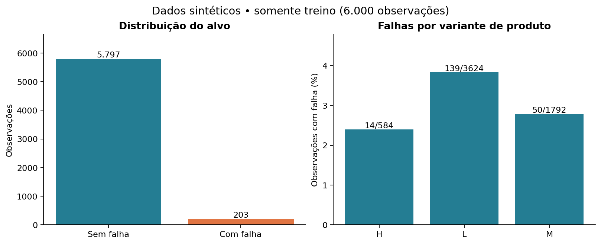
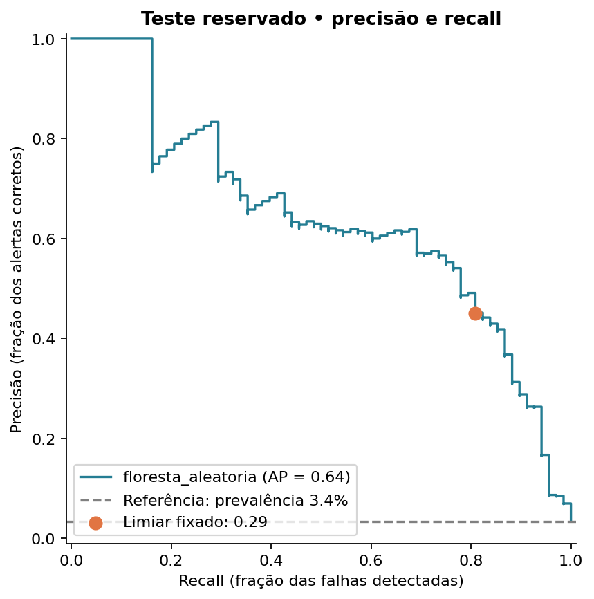
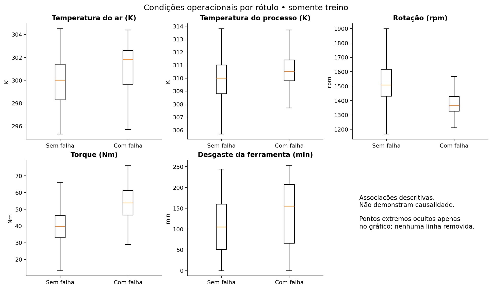

# Resultados calculados

Gerado por `python -m src.run`. Dados sintéticos AI4I 2020, sem evidência de antecipação temporal ou ganho fabril.

## Integridade e população

- 10000 observações; 339 falhas (3.39%).
- Ausências: 0; duplicatas nas seis entradas: 0.
- Rótulo principal diferente do OR dos modos: 27 observações. Mantidas com o alvo original; ver `divergencias_rotulos.csv`.
- EDA e importância calculadas, respectivamente, no treino e na validação. O teste permaneceu fora da seleção.

## Achados exploratórios no treino

O torque mediano foi 53.8 Nm nas observações com falha e 39.7 Nm nas sem falha. A rotação mediana foi 1365 rpm e 1507 rpm, respectivamente. As distribuições se sobrepõem: nenhuma dessas diferenças cria uma regra determinística ou uma recomendação de ajuste do processo.

A classe de falha é minoritária. Contagens e taxas por variante estão no gráfico abaixo; os grupos têm tamanhos diferentes, portanto volume de falhas e taxa de falhas respondem a perguntas distintas.

## Comparação na validação

| Modelo | AP | ROC AUC | Precisão (0,5) | Recall (0,5) |
|---|---:|---:|---:|---:|
| floresta_aleatoria | 0.5480 | 0.9647 | 58.33% | 61.76% |
| regressao_logistica | 0.3680 | 0.8788 | 14.25% | 82.35% |
| baseline | 0.0340 | 0.5000 | 0.00% | 0.00% |

Selecionado: **floresta_aleatoria**, por maior average precision (AP). AP é a média da precisão ponderada pelos incrementos de recall, sem interpolação trapezoidal.

Limiar **0.29** escolhido na validação para minimizar `FP + 10 × FN`; empates favorecem menos FP e depois maior limiar. Custo relativo hipotético, sem unidade monetária. O modelo foi mantido ajustado apenas no treino.

## Avaliação final no teste

Em 2000 observações, há 68 falhas reais do conjunto sintético.

- AP: **0.6407**; ROC AUC: **0.9650**.
- Recall: **80.88%**; precisão dos alertas: **45.08%**; F2: **0.6980**.
- 55 falhas detectadas, 13 não detectadas, 67 falsos alarmes e 1865 negativos corretos.
- 122 alertas (6.10% das observações); custo relativo: 197.
- IC de Wilson 95% do recall: 69.99% a 88.47%; da precisão: 36.54% a 53.93%.

Os intervalos condicionam o modelo e o limiar já fixados e supõem observações independentes. Não incorporam escolha de modelo, variabilidade entre treinos nem dependência da geração sintética.

## Sensibilidade de custo (somente validação)

| Custo FN / FP | Limiar | FP | FN | Custo relativo |
|---:|---:|---:|---:|---:|
| 1 | 0.62 | 18 | 38 | 56 |
| 5 | 0.47 | 34 | 22 | 144 |
| 10 | 0.29 | 79 | 14 | 219 |
| 20 | 0.14 | 198 | 4 | 278 |

Essa tabela discute políticas alternativas sem ajustar nada no teste. Para aplicação real, estimar custos e capacidade de inspeção com manutenção, operação e segurança.

## Interpretação

As maiores quedas médias de AP após permutação na validação foram:
- Torque [Nm]: 0.2934 (desvio entre permutações: 0.0245).
- Rotational speed [rpm]: 0.2214 (desvio entre permutações: 0.0261).
- Air temperature [K]: 0.1307 (desvio entre permutações: 0.0301).

Importância por permutação mede dependência do modelo, não efeito causal. Variáveis correlacionadas podem compartilhar importância. Os mecanismos sintéticos tornam parte das relações mais simples que em uma fábrica.

## Limites

Não há data/hora, identificação de equipamento, duração de parada ou custos. UDI não é uma linha do tempo. O split aleatório avalia generalização dentro desta base sintética; as temperaturas foram geradas com dependência entre registros, o que pode tornar a estimativa otimista. Uma aplicação real exige validação por equipamento e tempo, horizonte de previsão definido, disponibilidade das variáveis antes da falha, revisão dos rótulos, calibração e monitoramento. Nenhum OEE, economia ou redução de parada foi medido.

Fonte: [UCI AI4I 2020](https://doi.org/10.24432/C5HS5C), licença [CC BY 4.0](https://creativecommons.org/licenses/by/4.0/).
